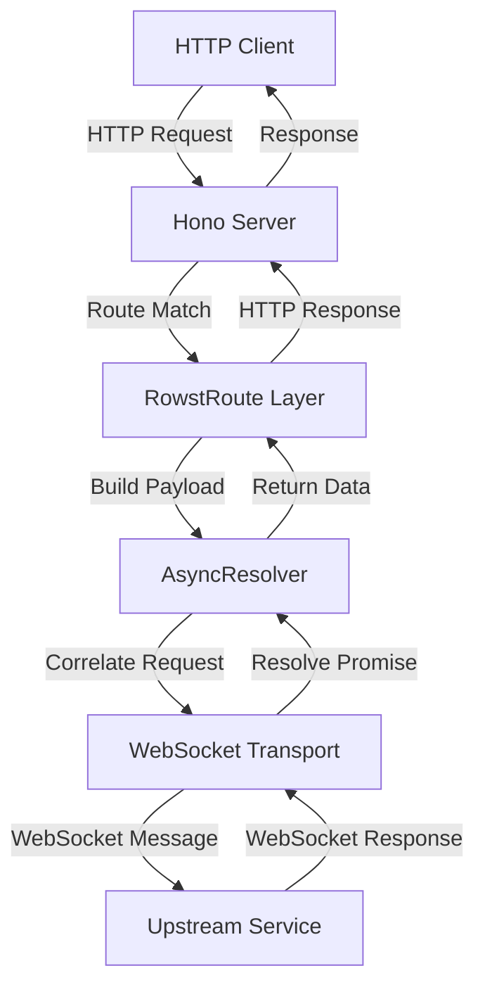
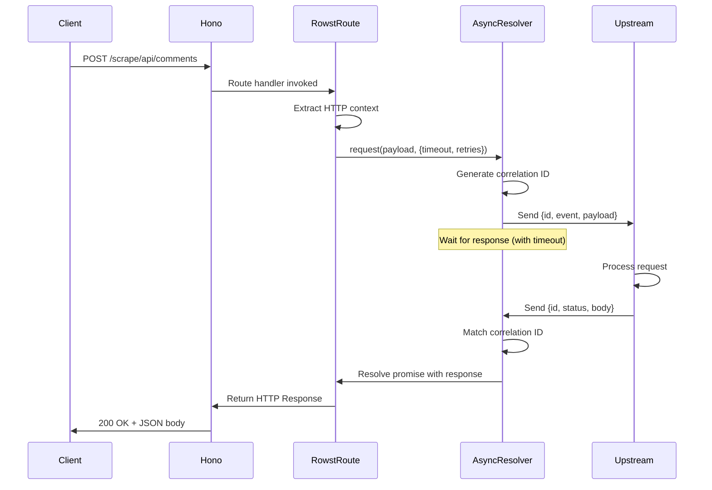

# Feature Proposal: Express-like API for Rowst

## Executive Summary

This proposal introduces an Express.js-inspired API layer for Rowst that simplifies the integration of HTTP REST endpoints with WebSocket event handlers. The API provides a unified interface for handling both HTTP requests (via Hono) and WebSocket communication (via Rowst's AsyncResolver), eliminating boilerplate code and reducing complexity in hybrid REST/WebSocket applications.

## Motivation

### Current Pain Points

In our Facebook scraper signalling service, we currently maintain separate implementations for:

1. **HTTP REST endpoints** (Hono routes)
2. **WebSocket event handlers** (custom message routing)
3. **Request/response correlation** (manual envelope building)
4. **Path-to-event mapping** (hardcoded string parsing)

**Current Implementation Example:**

```typescript
// backend/src/websocket/handlers/handle-forwarded-message.ts
export async function handleForwardedMessage(
  ws: ServerWebSocket<WebSocketData>,
  message: ForwardedMessage,
  state: WebSocketState
) {
  // Manual path parsing
  const parts = message.path.split("/").filter(Boolean);
  let resource: string | null = null;
  
  if (parts[0] === "scrape" && parts[1] === "api") {
    resource = parts[2];
  } else if (parts[0] === "api") {
    resource = parts[1];
  } else {
    resource = parts[0];
  }

  // Hardcoded event mapping
  const map: Record<string, WSMessage["type"]> = {
    comments: "get_comment",
    get_comment: "get_comment",
  };
  
  const type: WSMessage["type"] | null = map[resource] ?? null;
  // ... more boilerplate
}
```

```typescript
// backend/src/websocket/upstream-ws.ts
async function processRowstRequest(envelope: RowstRequestEnvelope) {
  // Capture pattern to sniff last message
  let lastMessage: WSMessage | null = null;
  const capture = {
    send: (s: string) => {
      try {
        const m = JSON.parse(s) as WSMessage;
        lastMessage = m;
      } catch {}
    },
  };
  
  // Route to handler
  await router.route(wsMessage, capture, state);
  
  // Build response envelope manually
  const response: RowstResponseEnvelope = {
    id: envelope.id,
    status: lastMessage ? 200 : 500,
    headers: { "content-type": "application/json" },
    body: lastMessage ? JSON.stringify(lastMessage) : "{}",
  };
  // ...
}
```

### Proposed Solution Benefits

1. **Unified API**: Single registration point for HTTP path + WebSocket event
2. **Type Safety**: Full TypeScript support with context types
3. **Reduced Boilerplate**: Automatic request/response correlation
4. **Express Familiarity**: Developers can leverage existing Express.js knowledge
5. **Testability**: Clear separation of concerns enables easier unit testing

## Proposed API Design

### Core Interface

```typescript
interface RowstRouteConfig {
  rest: string;              // HTTP path (Express-style patterns)
  event: string;             // WebSocket event name for upstream
  timeoutMs?: number;        // Optional per-route timeout
}

interface RowstRouteHandlerContext {
  honoContext: HonoContext;  // Full Hono context (req, res, params, etc.)
  websocketContext: {
    connected: boolean;
    request<T>(payload?: unknown, opts?: { timeout?: number; retries?: number }): Promise<UpstreamResponse & { data?: T }>;
    send(payload?: unknown): void;  // Fire-and-forget
  };
}

type RowstHandler = (ctx: RowstRouteHandlerContext) => Promise<Response> | Response;

class RowstRoute {
  constructor(opts: { app: Hono; resolver: AsyncResolver });
  
  get(config: RowstRouteConfig, handler: RowstHandler): void;
  post(config: RowstRouteConfig, handler: RowstHandler): void;
  put(config: RowstRouteConfig, handler: RowstHandler): void;
  delete(config: RowstRouteConfig, handler: RowstHandler): void;
  patch(config: RowstRouteConfig, handler: RowstHandler): void;
  all(config: RowstRouteConfig, handler: RowstHandler): void;
}
```

## Real-World Usage Examples

### Example 1: Get Comments Endpoint

**Current Implementation** (3 files, ~150 lines):

```typescript
// File 1: backend/src/server/router.ts
app.post("/scrape/api/comments", async (c) => {
  // Forward to WebSocket handler via custom envelope
  const envelope = buildRowstEnvelope(c.req);
  await upstreamWs.send(JSON.stringify(envelope));
  // Wait for response...
});

// File 2: backend/src/websocket/handlers/handle-forwarded-message.ts
export async function handleForwardedMessage(ws, message, state) {
  // Parse path, map to event, forward to domain handler
  const resource = parsePath(message.path);
  const eventType = mapResourceToEvent(resource);
  // ...
}

// File 3: backend/src/websocket/handlers/get-comment.ts
export async function handleGetComments(ws, message, state) {
  const { postUrl, limit, offset } = message.data;
  const comments = await repository.getComments(postUrl, { limit, offset });
  
  ws.send(JSON.stringify({
    type: "get_comment_response",
    data: { comments, total: comments.length }
  }));
}
```

**Proposed Implementation** (1 file, ~20 lines):

```typescript

// signalling/src/routes/comments.ts
import { RowstRoute } from "rowst/express";

export function registerCommentRoutes(routes: RowstRoute) {
  routes.post(
    {
      rest: "/scrape/api/comments",
      event: "get_comment",
      timeoutMs: 30000,
    },
    async ({ honoContext, websocketContext }) => {
      const { postUrl, limit = 50, offset = 0 } = await honoContext.req.json();
      
      // Forward to upstream and await response
      const result = await websocketContext.request<{
        comments: Comment[];
        total: number;
      }>({ postUrl, limit, offset });
      
      // Optional: Fire-and-forget analytics event
      websocketContext.send({ 
        event: "analytics", 
        action: "comments_requested",
        postUrl 
      });
      
      return honoContext.json(result.data, result.status);
    }
  );
}
```

### Example 2: Scrape Job Endpoint

```typescript
// signalling/src/routes/scrape.ts
routes.post(
  {
    rest: "/scrape/api/jobs",
    event: "start_scrape",
    timeoutMs: 5000,
  },
  async ({ honoContext, websocketContext }) => {
    const { postUrl, depth = 1 } = await honoContext.req.json();
    
    // Validate input
    if (!postUrl || !postUrl.startsWith("https://facebook.com")) {
      return honoContext.json(
        { error: "Invalid Facebook URL" },
        400
      );
    }
    
    // Check upstream connection
    if (!websocketContext.connected) {
      return honoContext.json(
        { error: "Scraper service unavailable" },
        503
      );
    }
    
    // Start scrape job
    const result = await websocketContext.request<{ jobId: string }>({
      postUrl,
      depth,
      priority: "normal",
    });
    
    return honoContext.json(result.data, result.status);
  }
);
```

### Example 3: Status Check with Fallback

```typescript
// signalling/src/routes/status.ts
routes.get(
  {
    rest: "/api/status/:jobId",
    event: "get_job_status",
    timeoutMs: 3000,
  },
  async ({ honoContext, websocketContext }) => {
    const jobId = honoContext.req.param("jobId");
    
    try {
      const result = await websocketContext.request<{
        status: string;
        progress: number;
      }>({ jobId }, { timeout: 3000, retries: 1 });
      
      return honoContext.json(result.data);
    } catch (error) {
      // Fallback to local cache if upstream times out
      const cached = await localCache.get(jobId);
      if (cached) {
        return honoContext.json({
          ...cached,
          cached: true,
        });
      }
      
      return honoContext.json(
        { error: "Job not found" },
        404
      );
    }
  }
);
```

## Implementation Architecture

### Component Diagram



### Sequence Diagram



## Unit Testing Strategy

### Test Structure

```typescript

// __tests__/rowst-route.test.ts
import { afterEach, beforeEach, describe, expect, it, mock } from "bun:test";
import { Hono } from "hono";
import { RowstRoute } from "../src/rowst-route";
import { MockAsyncResolver } from "./mocks/mock-resolver";
import { MockWebSocketTransport } from "./mocks/mock-transport";

describe("RowstRoute", () => {
  let app: Hono;
  let mockTransport: MockWebSocketTransport;
  let mockResolver: MockAsyncResolver;
  let routes: RowstRoute;

  beforeEach(() => {
    app = new Hono();
    mockTransport = new MockWebSocketTransport();
    mockResolver = new MockAsyncResolver(mockTransport);
    routes = new RowstRoute({ app, resolver: mockResolver });
  });

  afterEach(() => {
    mockTransport.close();
  });

  describe("HTTP Method Registration", () => {
    it("should register POST route", async () => {
      routes.post(
        { rest: "/api/test", event: "test_event" },
        async ({ honoContext }) => honoContext.json({ ok: true })
      );

      const res = await app.request("/api/test", { method: "POST" });
      expect(res.status).toBe(200);
      expect(await res.json()).toEqual({ ok: true });
    });

    it("should register GET route with path parameters", async () => {
      routes.get(
        { rest: "/api/users/:id", event: "get_user" },
        async ({ honoContext }) => {
          const id = honoContext.req.param("id");
          return honoContext.json({ userId: id });
        }
      );

      const res = await app.request("/api/users/123");
      expect(res.status).toBe(200);
      expect(await res.json()).toEqual({ userId: "123" });
    });

    it("should register ALL methods", async () => {
      routes.all(
        { rest: "/api/wildcard", event: "any_event" },
        async ({ honoContext }) => honoContext.json({ method: honoContext.req.method })
      );

      for (const method of ["GET", "POST", "PUT", "DELETE", "PATCH"]) {
        const res = await app.request("/api/wildcard", { method });
        expect(res.status).toBe(200);
        expect(await res.json()).toEqual({ method });
      }
    });
  });

  describe("WebSocket Context", () => {
    it("should forward request to upstream and return response", async () => {
      mockResolver.mockResponse({
        status: 200,
        headers: { "content-type": "application/json" },
        bodyText: JSON.stringify({ result: "success" }),
      });

      routes.post(
        { rest: "/api/forward", event: "forward_event" },
        async ({ honoContext, websocketContext }) => {
          const result = await websocketContext.request({ test: "data" });
          return honoContext.json(result.data);
        }
      );

      const res = await app.request("/api/forward", {
        method: "POST",
        body: JSON.stringify({ test: "data" }),
        headers: { "content-type": "application/json" },
      });

      expect(res.status).toBe(200);
      expect(await res.json()).toEqual({ result: "success" });
      expect(mockTransport.sentMessages).toHaveLength(1);
      expect(mockTransport.sentMessages[0].payload.event).toBe("forward_event");
    });

    it("should handle upstream timeout", async () => {
      mockResolver.mockTimeout();

      routes.post(
        { rest: "/api/timeout", event: "timeout_event", timeoutMs: 100 },
        async ({ honoContext, websocketContext }) => {
          try {
            await websocketContext.request();
            return honoContext.json({ ok: true });
          } catch (error) {
            return honoContext.json({ error: "timeout" }, 504);
          }
        }
      );

      const res = await app.request("/api/timeout", { method: "POST" });
      expect(res.status).toBe(504);
      expect(await res.json()).toEqual({ error: "timeout" });
    });

    it("should handle disconnected upstream", async () => {
      mockTransport.disconnect();

      routes.post(
        { rest: "/api/disconnected", event: "test_event" },
        async ({ honoContext, websocketContext }) => {
          if (!websocketContext.connected) {
            return honoContext.json({ error: "service unavailable" }, 503);
          }
          return honoContext.json({ ok: true });
        }
      );

      const res = await app.request("/api/disconnected", { method: "POST" });
      expect(res.status).toBe(503);
    });

    it("should support fire-and-forget send", async () => {
      routes.post(
        { rest: "/api/fire-forget", event: "analytics" },
        async ({ honoContext, websocketContext }) => {
          websocketContext.send({ action: "log_event" });
          return honoContext.json({ ok: true });
        }
      );

      const res = await app.request("/api/fire-forget", { method: "POST" });
      expect(res.status).toBe(200);
      expect(mockTransport.sentMessages).toHaveLength(1);
      expect(mockTransport.sentMessages[0].payload.event).toBe("analytics");
    });
  });

  describe("Request Payload Building", () => {
    it("should extract HTTP method, path, and query params", async () => {
      let capturedPayload: any;

      routes.get(
        { rest: "/api/extract", event: "extract_event" },
        async ({ websocketContext }) => {
          const result = await websocketContext.request();
          capturedPayload = mockTransport.sentMessages[0].payload;
          return new Response(null, { status: 204 });
        }
      );

      await app.request("/api/extract?foo=bar&baz=qux");

      expect(capturedPayload.method).toBe("GET");
      expect(capturedPayload.path).toBe("/api/extract");
      expect(capturedPayload.query).toBe("?foo=bar&baz=qux");
    });

    it("should extract JSON body from POST request", async () => {
      let capturedPayload: any;

      routes.post(
        { rest: "/api/json", event: "json_event" },
        async ({ websocketContext }) => {
          await websocketContext.request();
          capturedPayload = mockTransport.sentMessages[0].payload;
          return new Response(null, { status: 204 });
        }
      );

      await app.request("/api/json", {
        method: "POST",
        body: JSON.stringify({ key: "value" }),
        headers: { "content-type": "application/json" },
      });

      expect(capturedPayload.body).toEqual({ key: "value" });
    });

    it("should override body when provided to request()", async () => {
      let capturedPayload: any;

      routes.post(
        { rest: "/api/override", event: "override_event" },
        async ({ websocketContext }) => {
          await websocketContext.request({ overridden: true });
          capturedPayload = mockTransport.sentMessages[0].payload;
          return new Response(null, { status: 204 });
        }
      );

      await app.request("/api/override", {
        method: "POST",
        body: JSON.stringify({ original: true }),
        headers: { "content-type": "application/json" },
      });

      expect(capturedPayload.body).toEqual({ overridden: true });
    });
  });

  describe("Response Handling", () => {
    it("should parse JSON response body", async () => {
      mockResolver.mockResponse({
        status: 200,
        bodyText: JSON.stringify({ parsed: true }),
      });

      routes.get(
        { rest: "/api/parse", event: "parse_event" },
        async ({ honoContext, websocketContext }) => {
          const result = await websocketContext.request();
          return honoContext.json({ data: result.data });
        }
      );

      const res = await app.request("/api/parse");
      expect(await res.json()).toEqual({ data: { parsed: true } });
    });

    it("should handle non-JSON response body", async () => {
      mockResolver.mockResponse({
        status: 200,
        bodyText: "plain text",
      });

      routes.get(
        { rest: "/api/text", event: "text_event" },
        async ({ honoContext, websocketContext }) => {
          const result = await websocketContext.request();
          return honoContext.text(result.bodyText);
        }
      );

      const res = await app.request("/api/text");
      expect(await res.text()).toBe("plain text");
    });

    it("should preserve HTTP status codes", async () => {
      mockResolver.mockResponse({
        status: 404,
        bodyText: JSON.stringify({ error: "not found" }),
      });

      routes.get(
        { rest: "/api/status", event: "status_event" },
        async ({ honoContext, websocketContext }) => {
          const result = await websocketContext.request();
          return honoContext.json(result.data, result.status);
        }
      );

      const res = await app.request("/api/status");
      expect(res.status).toBe(404);
    });
  });

  describe("Error Handling", () => {
    it("should handle resolver errors gracefully", async () => {
      mockResolver.mockError(new Error("Connection failed"));

      routes.post(
        { rest: "/api/error", event: "error_event" },
        async ({ honoContext, websocketContext }) => {
          try {
            await websocketContext.request();
            return honoContext.json({ ok: true });
          } catch (error) {
            return honoContext.json(
              { error: error.message },
              500
            );
          }
        }
      );

      const res = await app.request("/api/error", { method: "POST" });
      expect(res.status).toBe(500);
      expect(await res.json()).toEqual({ error: "Connection failed" });
    });

    it("should support retry logic", async () => {
      let attemptCount = 0;
      mockResolver.mockDynamicResponse(() => {
        attemptCount++;
        if (attemptCount < 3) {
          throw new Error("Temporary failure");
        }
        return {
          status: 200,
          bodyText: JSON.stringify({ success: true, attempts: attemptCount }),
        };
      });

      routes.post(
        { rest: "/api/retry", event: "retry_event" },
        async ({ honoContext, websocketContext }) => {
          const result = await websocketContext.request(undefined, {
            retries: 2,
            timeout: 1000,
          });
          return honoContext.json(result.data);
        }
      );

      const res = await app.request("/api/retry", { method: "POST" });
      expect(res.status).toBe(200);
      expect(await res.json()).toEqual({ success: true, attempts: 3 });
    });
  });

  describe("Integration with Real Upstream", () => {
    it("should handle real comment retrieval flow", async () => {
      // Mock upstream response matching our actual backend format
      mockResolver.mockResponse({
        status: 200,
        bodyText: JSON.stringify({
          type: "get_comment_response",
          data: {
            comments: [
              { id: "1", text: "Test comment", author: "User1" },
              { id: "2", text: "Another comment", author: "User2" },
            ],
            total: 2,
          },
        }),
      });

      routes.post(
        { rest: "/scrape/api/comments", event: "get_comment" },
        async ({ honoContext, websocketContext }) => {
          const { postUrl, limit, offset } = await honoContext.req.json();
          
          const result = await websocketContext.request({
            postUrl,
            limit,
            offset,
          });

          return honoContext.json(result.data);
        }
      );

      const res = await app.request("/scrape/api/comments", {
        method: "POST",
        body: JSON.stringify({
          postUrl: "https://facebook.com/post/123",
          limit: 50,
          offset: 0,
        }),
        headers: { "content-type": "application/json" },
      });

      expect(res.status).toBe(200);
      const json = await res.json();
      expect(json.data.comments).toHaveLength(2);
      expect(json.data.total).toBe(2);
    });
  });
});
```

### Mock Implementations

```typescript
// __tests__/mocks/mock-resolver.ts
export class MockAsyncResolver {
  private mockResponses: Map<string, any> = new Map();
  private mockErrors: Map<string, Error> = new Map();
  private timeouts: Set<string> = new Set();

  mockResponse(response: any, event?: string) {
    this.mockResponses.set(event ?? "default", response);
  }

  mockError(error: Error, event?: string) {
    this.mockErrors.set(event ?? "default", error);
  }

  mockTimeout(event?: string) {
    this.timeouts.add(event ?? "default");
  }

  mockDynamicResponse(fn: () => any) {
    this.dynamicResponseFn = fn;
  }

  async request(payload: any, opts?: any): Promise<any> {
    const event = opts?.meta?.event ?? "default";

    if (this.timeouts.has(event)) {
      await new Promise((_, reject) =>
        setTimeout(() => reject(new Error("Timeout")), opts?.timeout ?? 100)
      );
    }

    if (this.mockErrors.has(event)) {
      throw this.mockErrors.get(event);
    }

    if (this.dynamicResponseFn) {
      return { payload: this.dynamicResponseFn() };
    }

    return {
      payload: this.mockResponses.get(event) ?? this.mockResponses.get("default"),
    };
  }

  getTransportState() {
    return this.transport.isConnected() ? "open" : "closed";
  }
}

// __tests__/mocks/mock-transport.ts
export class MockWebSocketTransport {
  public sentMessages: any[] = [];
  private connected = true;

  send(message: any) {
    this.sentMessages.push(message);
  }

  disconnect() {
    this.connected = false;
  }

  isConnected() {
    return this.connected;
  }

  close() {
    this.connected = false;
    this.sentMessages = [];
  }
}
```

## Implementation Checklist

- [ ] Core `RowstRoute` class implementation
- [ ] HTTP method registration (GET, POST, PUT, DELETE, PATCH, ALL)
- [ ] WebSocket context builder with `request()` and `send()` methods
- [ ] Request payload extraction from Hono context
- [ ] Response envelope parsing and type inference
- [ ] Connection state checking
- [ ] Timeout and retry support
- [ ] TypeScript type definitions and exports
- [ ] Unit tests for all public methods
- [ ] Integration tests with mock upstream
- [ ] Documentation and usage examples
- [ ] Migration guide from manual implementation

## Performance Considerations

1. **Request Correlation**: Uses existing AsyncResolver correlation mechanism (no additional overhead)
2. **Memory**: Minimal - only stores route registrations and active request promises
3. **Latency**: ~1-2ms overhead for context building and payload extraction
4. **Throughput**: No bottleneck - delegates to Hono and AsyncResolver

## Migration Path

For existing projects like our Facebook scraper:

1. **Phase 1**: Add RowstRoute alongside existing implementation
2. **Phase 2**: Migrate one route at a time, testing thoroughly
3. **Phase 3**: Remove old manual implementations once all routes migrated
4. **Phase 4**: Deprecate custom envelope building code

## Conclusion

This Express-like API significantly reduces complexity in hybrid REST/WebSocket applications while maintaining full compatibility with existing Rowst infrastructure. The proposed implementation is minimal, testable, and provides immediate value to developers building signalling services.

## References

- Current implementation: [`backend/src/websocket/handlers/handle-forwarded-message.ts`](backend/src/websocket/handlers/handle-forwarded-message.ts)
- Upstream processing: [`backend/src/websocket/upstream-ws.ts`](backend/src/websocket/upstream-ws.ts)
- Domain handlers: [`backend/src/websocket/handlers/get-comment.ts`](backend/src/websocket/handlers/get-comment.ts)
- Rowst library: [`rowst-one-code.txt`](rowst-one-code.txt)
